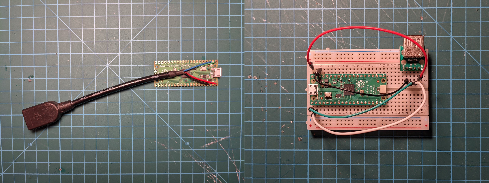

# PS5 adapter for old Logitech wheels

This is an adapter that lets you use older Logitech wheels like the Driving Force Pro, G25 or G27 with PS5 games. It requires an additional controller belonging to the ["specialty peripheral"](https://blog.playstation.com/2020/08/03/playstation-5-answering-your-questions-on-compatible-ps4-peripherals-accessories/) class to satisfy the console's authentication requirements.

You will need:

* Raspberry Pi Pico.
* USB Type A female connector. Either an extension cable cut in half or a breakout board.
* USB hub. Unfortunately not all hubs work so you will have to try and see.
* Officially licensed PS4 controller that works in PS5 games by itself (not necessarily driving games). Arcade sticks and pad-shaped controllers specifically meant for fighting games are a good bet. I used a Razer Raion. A DualShock 4 will not work.

To make the device, either cut a USB extension cable in half and solder the wires to the right pins on the Pico, or if you don't want to solder, get a Pico with headers, a breadboard, a female USB Type A breakout board and some jumper wires. Make these connections:

| Pico | USB port or cable |
| ---: | -------- |
| GPIO0 (pin 1) | D+ (typically green) |
| GPIO1 (pin 2) | D- (typically white) |
| VBUS (pin 40) | VBUS/5V |
| GND (pin 38) | GND |

You're looking to make one of the things below:



Then flash the Pico with the firmware by doing the following. Press and hold the BOOTSEL button and while holding it, connect the Pico to your computer. A drive named "RPI-RP2" should appear. Copy the [adapter.uf2](adapter.uf2) file to that drive. That's it.

Then plug a USB hub into the port you added to the Pico and plug both your wheel and the controller you want to use for authentication into the hub. Then connect the Pico to your PS5.


The wheel will operate in Driving Force compatibility mode so even if your wheel has a PlayStation button, it probably won't work. Pressing the "select" and "start" buttons at the same time works as the PlayStation button. If your wheel has more buttons than the basic 12, you probably won't be able to use them as unique buttons (they will work as duplicates of the standard ones).

The wheel will also probably operate in 200 degree mode by default. You have to put it in 900 degree (or whatever) mode manually. On a Driving Force Pro you press "select", R3 and the upshift paddle simultaneously.

## Q&A

**Will a DualShock 4 work?**

No.

**Does it suffer from the 8 minute timeout?**

Not if you connect the right controller for authentication.

**Does force feedback work?**

Yes.

**What wheels did you actually test it with?**

A Driving Force Pro, but I'm optimistic about the others because they all have a Driving Force compatibility mode.

**What does the LED mean?**

The LED turns on after we successfully send the authentication data to the console and turns off again the next time the console initiates the authentication process. So if everything is working correctly, the LED should be on most of the time.

**Can I use a RP2040-based board other than the Pico?**

Yes.

**Can I use Adafruit's Feather RP2040 USB Host board?**

In theory it should work, but when I tried it some weird things happened, not sure why.

**Does it use Remote Play?**

No.

**Could it be modified to support other wheels?**

Yes.

**Could it be modified to support standalone pedals and shifters?**

Yes.

**Could it be modified to support DIY peripherals connected to GPIO pins?**

Yes.

**Could it be modified to support non-linear curves on the pedals?**

Yes.

**Would it work with a PS4?**

Probably.

**How do I compile the firmware?**

```
git clone https://github.com/jfedor2/wheel-adapter
cd wheel-adapter
git submodule update --init
mkdir build
cd build
cmake ..
make
```
